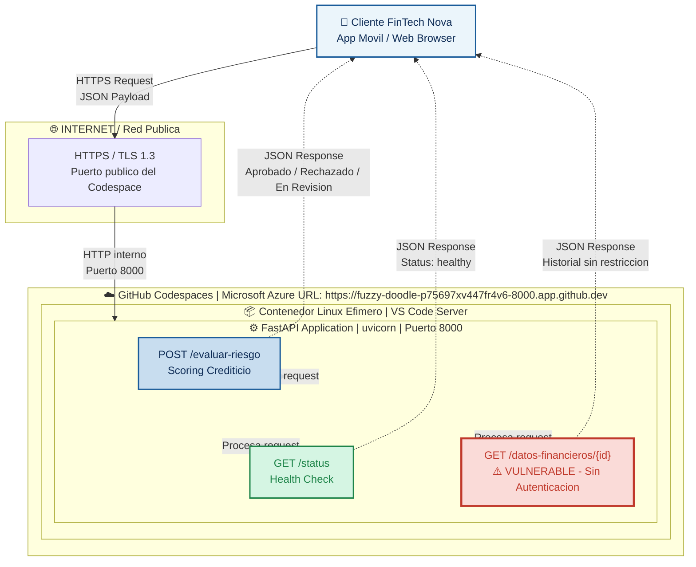

# Seminario-ARQUITECTURAS-DIGITALES-SEGURAS-Y-AUTOMATIZADAS

## PROYECTO: Proyecto Final Integrador: Arquitectura, Seguridad y  Automatización de una API de Predicción en la Nube
### Roslaysoft x FinTech Nova 

## DESCRIPCIÓN DEL PROYECTO: 
En la actualidad, las aplicaciones no operan de forma aislada; viven en ecosistemas 
dinámicos en la nube que requieren ser rápidos, seguros y escalables. Durante este 
seminario, los estudiantes actuarán como Arquitectos Cloud para una empresa simulada 
de tecnología.

## El Caso de Estudio: "FinTech Nova" y la API de Riesgo Crediticio
El Contexto (El Roleplay para los estudiantes): La firma consultora Roslaysoft ha cerrado 
un contrato con FinTech Nova, una startup financiera de rápido crecimiento que ofrece 
microcréditos 100% digitales. Actualmente, FinTech Nova tiene su motor de "Evaluación de 
Riesgo Crediticio" (Credit Scoring) corriendo en un servidor local antiguo que se satura los 
fines de semana.
Han contratado a los estudiantes para que tomen el código base de ese motor (la API en 
FastAPI) y diseñen una arquitectura en la nube que sea segura, escalable y automatizada.

## Integrantes del Grupo 

| GRUPO 9 |  

| DAVID FELIPE TRIANA GONZÁLEZ | [@usuario1](https://github.com/dftrianag-code/DavidTriana.git) | 

| FRANK LEONARDO CARVAJAL ROJAS | [@usuario2](https://github.com/flcarvajalr-collab/frank) | 

| JUAN FELIPE ESCOBAR FLOREZ |  | 

# Laboratorio 1 — Arquitectura As-Is 

 

### URL del Codespace 

### URL pública de APPI SeminarioSanMateo Bifurcado de RoslayBautista/SeminarioSanmateo:

https://laughing-yodel-p7jp54gxj9gr37qjr-8000.app.github.dev/ 

https://laughing-yodel-p7jp54gxj9gr37qjr-8000.app.github.dev/docs 

### URL pública de APPI Seminario-ARQUITECTURAS-DIGITALES-SEGURAS-Y-AUTOMATIZADAS de mi repositorio:

https://fuzzy-doodle-p75697xv447fr4v6-8000.app.github.dev/

 
### Diagrama Arquitectonico As-Is 

El siguiente diagrama representa el estado actual del sistema de evaluación de riesgo crediticio de FinTech Nova desplegado en GitHub Codespaces: 

 
### Version interactiva (Mermaid) 

